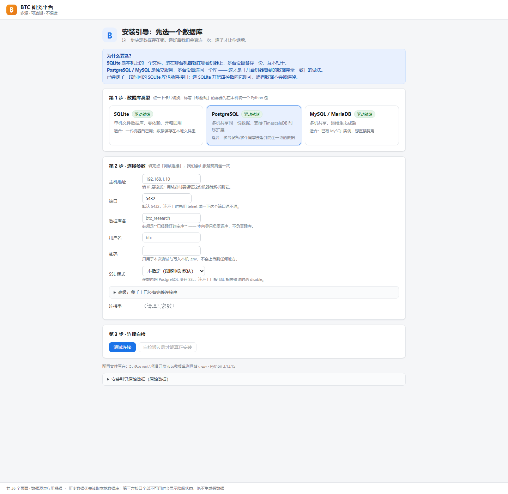
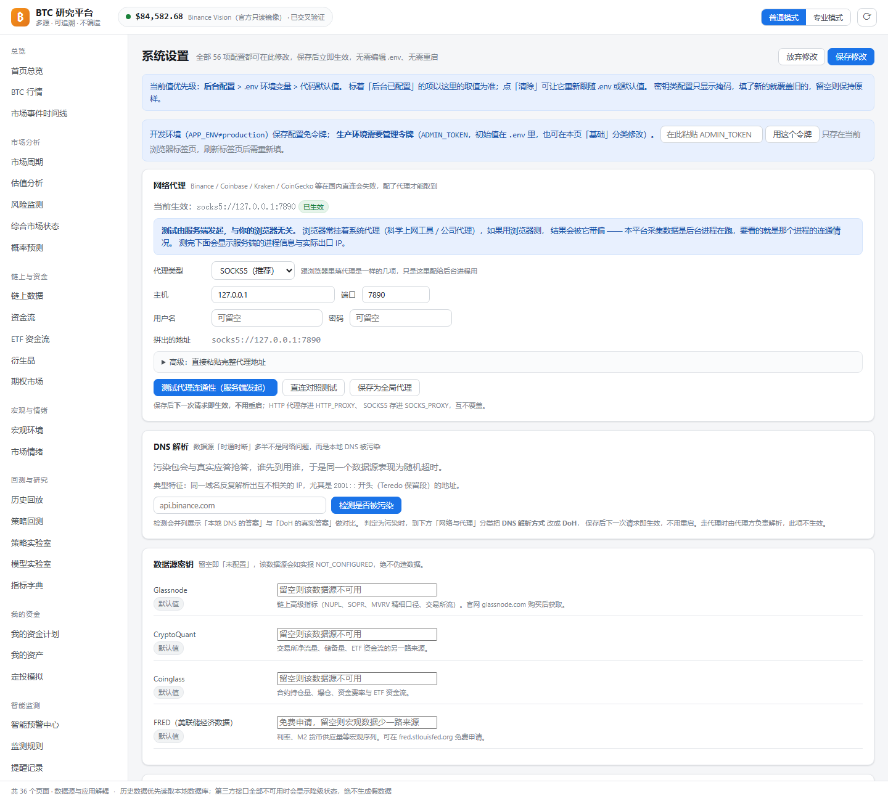

<div align="center">

# BTC 全市场智能研究平台

**把散落在几十个数据源里的 BTC 信息，收敛成一个能长期运行、每个数字都能追到来源的研究底座。**

多数据源高可用 · 本地历史优先 · 严格防未来数据泄漏 · 预测只给概率区间

[](https://www.python.org/)
[](https://fastapi.tiangolo.com/)
[](#多数据库支持)
[](LICENSE)
[](#测试)
[](#快速开始)
[](https://github.com/tanglx02/btc-research-platform/releases/latest)

**Windows 一键便携版（含 Python 运行时，解压即跑）：** [👉 Releases 下载](https://github.com/tanglx02/btc-research-platform/releases/latest)

</div>

---

## 这是什么

一个**自托管的 BTC 全市场研究平台**。它把行情、链上、资金流、衍生品、宏观、情绪六类数据统一接入，
在其上做周期识别、估值、风险监测、概率预测、策略回测与条件预警，并保证**每一个展示出来的数字都能点进去看到它的来源报文**。

它不是一个"抓个价格显示出来"的看板，而是围绕三件事认真做的工程：

| 目标 | 具体做法 |
|---|---|
| **数据要可信** | 多源交叉验证，偏差超阈值就标 `DISPUTED`；宁可显示"数据不可用"，**绝不用假数据填充** |
| **结论要可追** | Raw + Normalized 双存储，页面上任何数字都能回溯到原始 JSON 与请求时间 |
| **长期运行不烂** | 健康评分 + 主动熔断 + 自动切换到备用源；断点续传补洞；45 张表的迁移机制 |

---

## 快速开始

### 环境要求

| 项 | 要求 |
|---|---|
| Python | **3.11+**（项目在 3.13 上开发与验证） |
| 操作系统 | Windows 10/11、Linux |
| 数据库 | **SQLite / PostgreSQL / MySQL 三选一**，首启在网页上选 |
| Node | **不需要**。前端零构建，原生 JS + ECharts |

### 三步跑起来

```bash
# 1. 安装依赖
python -m venv .venv
.venv/Scripts/activate          # Linux/macOS: source .venv/bin/activate
pip install -r requirements.txt
# 国内加速：pip install -r requirements.txt -i https://mirrors.cloud.tencent.com/pypi/simple
# 想用 PostgreSQL / MySQL 时再装对应异步驱动：
#   pip install asyncpg          # PostgreSQL
#   pip install aiomysql         # MySQL

# 2. 启动（首次启动会自动进入安装引导）
python scripts/btcctl.py serve --host 127.0.0.1 --port 8000
```

打开 **http://127.0.0.1:8000** —— **首次访问会进入安装引导页**：

1. 选数据库类型（SQLite / PostgreSQL / MySQL）
2. 填连接参数
3. 点「测试连接」做 5 项自检，**全部通过才能保存并继续**

自检通过后平台自动建表、写种子数据、注册数据源并启动调度器。接口文档在 `/docs`。

> 已经跑过老版本（`.env` 里没有 `SETUP_COMPLETED`）也不用重装：
> 平台检测到库里已有 ≥5 张本平台表，会**自动接管**现有部署并补写 `SETUP_COMPLETED=true`。

### 一键脚本（推荐用于长期部署）

```bash
scripts/windows/install.bat      # 或 scripts/linux/install.sh
scripts/windows/menu.bat         # 交互式运维菜单
```

提供 `start / stop / restart / status / doctor / backup / restore / update / uninstall` 全套，
Linux 端另附 systemd 单元与 nginx 反代样例。

### 回填历史数据

```bash
python scripts/btcctl.py backfill --days 730     # 断点续传，中断了再跑会接着补
python scripts/btcctl.py gap-repair              # 扫描并补齐缺口
python scripts/btcctl.py collect-all             # 链上/衍生品/情绪/宏观/ETF 全量采集
```

---

## 界面截图

### 首页总览

实时价格、多源交叉验证状态与偏差一目了然。顶部显示的 `CROSS_VERIFIED` 与偏差值来自真实的多源比对，不是装饰。


### 数据源中心

27 个数据源的实时健康情况、评分与自动切换记录。**失败的源会如实显示失败原因**（如 Yahoo 的 `HTTP 403`、Stooq 的解析为空），而不是假装正常。


### 系统设置

全部 56 项配置都能在后台改，保存后立即生效，**无需编辑 `.env`、无需重启**。密钥类配置只显示掩码。


### 安装引导：选数据库

首次启动的引导页。选完数据库类型填参数，点「测试连接」会由**服务端**做 5 项自检（连接串格式 → 异步驱动 → 建立连接取版本 → 已有表对比 → 建删临时表验读写权限），
任意一项不通过都会给出可读的排查建议，**并且不会把错误的连接串写进 `.env`**。



### 网络代理设置（浏览器式）

和浏览器代理面板一样的用法：先选协议（`socks5` / `socks4` / `http` / `https`），再填主机、端口、可选的用户名与密码，下方实时预览拼好的地址（口令自动掩码）。
点「测试代理连通性」的请求**由服务端发起**，结果里会回显发起方的主机名、进程 PID、内网 IP，可据此确认不是浏览器在测。



### 市场周期


### 风险监测


### 综合市场状态（Regime）


### 概率预测

只输出概率区间与不确定性说明，不给"明天涨到 X"这种无法证伪的结论。


### 链上数据 / 资金流 / ETF / 衍生品

| | |
|---|---|
|  |  |
|  |  |

### BTC 行情 / 估值 / 宏观 / 情绪

| | |
|---|---|
|  |  |
|  |  |

### 策略回测 / 定投模拟 / 智能预警 / 数据质量

| | |
|---|---|
|  |  |
|  |  |

---

## 架构


```
数据源（27 个）
      ↓
接入层    ProviderTransport ── 代理 / DoH / 重试 / 限流 / 超时 统一落这里
          ResilientRouter  ── 健康评分（0-100）+ 主动熔断 + 主备自动切换
      ↓
存储层    Raw 原始 JSON（可回溯）+ Normalized 规范化（45 张表，幂等写入）
      ↓
引擎层    指标 / 周期 / 估值 / 风险 / Regime / 预测 / 回测 / 回放 / 预警
      ↓
交付层    FastAPI（83 个接口）+ SPA 前端（36 个页面）+ CLI（18 个子命令）
```

### 项目结构

```
btc数据监测网站/
├── backend/
│   ├── app/
│   │   ├── main.py            # 应用入口、lifespan、路由挂载、静态前端
│   │   ├── core/              # 配置、日志、DNS 解析、代理、缓存、错误
│   │   ├── providers/         # 数据源抽象层
│   │   │   ├── base.py        #   DataProvider 基类
│   │   │   ├── registry.py    #   注册表与自动发现
│   │   │   ├── router.py      #   ResilientRouter 主备切换
│   │   │   ├── health.py      #   健康评分与熔断
│   │   │   ├── validation.py  #   多源交叉验证
│   │   │   ├── transport.py   #   统一 HTTP 出口（代理/DoH/重试）
│   │   │   └── impl/          #   12 个 Provider 实现（覆盖 27 个源）
│   │   ├── collectors/        # 历史回填、增量同步、缺口补洞
│   │   ├── db/                # 模型、迁移、仓储、种子数据
│   │   ├── engines/           # 指标/周期/估值/风险/Regime/预测
│   │   ├── services/          # 行情/回测/回放/策略/资金计划/健康
│   │   └── alerts/            # 智能监测、规则求值、通知渠道
│   └── tests/                 # 412 个用例，20 个测试文件
├── frontend/                  # SPA 前端（原生 JS，零构建）
│   └── static/{css,js,vendor}
├── scripts/
│   ├── btcctl.py              # 主运维 CLI（18 个子命令）
│   ├── windows/  linux/       # 双平台一键脚本
│   └── *_drill.py             # 演练脚本（数据源/代理/备份/预警）
├── docs/                      # 36 份设计文档
└── requirements.txt
```

---

## 多数据库支持

数据不再被 SQLite 绑死。SQLite 适合单机，PostgreSQL / MySQL 适合**多台设备共用同一个库、数据保持一致**。

| 方言 | 异步驱动 | 适用场景 | 连接串示例 |
|---|---|---|---|
| **SQLite** | `aiosqlite`（内置） | 单机、零依赖、便携版 | `sqlite+aiosqlite:///data/btc.db` |
| **PostgreSQL** | `asyncpg` | 多人/多机共享、生产环境；可叠加 TimescaleDB | `postgresql+asyncpg://btc:口令@10.0.0.5:5432/btc` |
| **MySQL** | `aiomysql` | 已有 MySQL 运维体系的团队 | `mysql+aiomysql://btc:口令@10.0.0.5:3306/btc` |

首启在网页引导页里选，也可以随时用命令行验证连接：

```bash
python scripts/btcctl.py db-test --url "postgresql+asyncpg://btc:口令@10.0.0.5:5432/btc"
python scripts/btcctl.py setup-reset          # 重置安装状态，重新走一遍引导
```

**跨方言差异全部收敛在两个模块里**（新增方言只需改这两处）：

| 模块 | 职责 |
|---|---|
| `backend/app/db/dialects.py` | URL 归一化、异步驱动强制、驱动是否安装、可读报错、口令 URL 编码、掩码 |
| `backend/app/db/upsert.py` | SQLite/PG 走 `ON CONFLICT … DO UPDATE`，MySQL 走 `ON DUPLICATE KEY UPDATE`；`DO NOTHING` 在 MySQL 上退化为 `INSERT IGNORE` |

> **一个容易踩的坑**：`postgresql+psycopg://` 里的 psycopg 是**同步**驱动，装到 asyncio 引擎上第一次查询就崩。
> 平台在 `dialects.normalize_to_async()` 里统一纠正为异步驱动，即使你填了同步串也会被自动改对。
>
> 45 张表的 DDL 在三种方言下均通过 `CreateTable(...).compile()` 校验（含 MySQL 的「TEXT/JSON 不能有 DEFAULT」「VARCHAR 必须给长度」约束），
> 由 `backend/tests/test_db_dialects.py` 守住。

---

## 核心特性

### 1. 多数据源高可用

每个数据源都有独立的健康评分（0-100）。评分持续走低会自动降级到备用源，**失败原因如实记录并展示**，不做静默兜底。

- **主备切换**：`ResilientRouter` 按优先级 + 健康分选路，主源失败自动切备用
- **主动熔断**：连续失败进入冷却，避免每次请求都卡在坏源上
- **交叉验证**：同一指标多源取数，偏差超阈值标 `DISPUTED`，一致则标 `CROSS_VERIFIED`

### 2. 网络策略：代理与 DNS 污染

国内环境访问海外数据源，**最常见的失败不是网络不通，而是 DNS 被污染** —— 同一域名每次解析出不同 IP，表现成"一会儿通一会儿超时"。

平台内置两套解法：

| 能力 | 说明 |
|---|---|
| **SOCKS5 / HTTP(S) 代理** | 全局代理 + 单源独立代理，改完立即生效（连接池自动重建）。后台按浏览器样式提供 `socks5 / socks4 / http / https` 协议下拉 + 主机/端口/用户名/密码输入框 |
| **DoH 解析** | 绕开本地 DNS 污染；支持 JSON 与二进制报文两种协议方言，自动降级 |

代理连通性测试**由服务端发起**（`POST /api/v1/system/proxy/test`），响应里回显发起方的主机名、进程 PID、内网 IP 与请求方 IP，
可以直接验证「到底是服务器在测还是浏览器在测」—— 浏览器自己挂的代理不会影响这个结果。

> **实测数据**：阿里公共 DNS 只认 RFC 8484 二进制报文（`?dns=<base64url>`），问 JSON 形式会返回
> `400 no 'dns' query parameter found`；而它又是国内少数稳定可达的 DoH 端点。
> 平台因此实现了"先问 JSON，失败自动改问报文"的降级链 —— 详见 [`docs/36`](docs/36-网络策略代理与DNS解析.md)。

内置污染诊断接口，直接告诉你本地 DNS 返回了什么、真实答案是什么：

```bash
curl "http://127.0.0.1:8000/api/v1/system/dns/diagnose?host=api.binance.com"
```

```json
{
  "system_ips": ["108.160.162.98", "2001::6ca0:a5d4"],
  "doh_ips": ["75.126.124.162"],
  "poisoned_ips": ["2001::6ca0:a5d4"],
  "verdict": "poisoned",
  "advice": "本地 DNS 返回了保留地址段（典型的污染特征）。建议把「DNS 解析方式」改成 DoH。"
}
```

`2001::/32` 是 Teredo 保留段 —— 正常 A 记录里不该出现，命中即可判定污染。

### 3. 本地历史优先

- **断点续传**：回填中断后重跑会从断点继续，不重复拉取
- **缺口补洞**：主动扫描本地历史的空洞并补齐（`btcctl gap-repair`）
- **双存储**：Raw 层保存原始 JSON（可回溯），Normalized 层规范化后供引擎消费
- **幂等写入**：重复采集不产生重复数据

### 4. 严格防未来数据泄漏

回测与回放**只使用当时可得的数据**，不允许出现"用未来价格算今日指标"这类错误。
测试套件中有专门的用例守着这条线：

```bash
pytest backend/tests/test_backtest_no_future_leak.py -v
pytest backend/tests/test_checkpoint_resume.py -v
```

### 5. 配置全部可在后台修改

56 项配置（含数据源密钥、代理、DNS、预警阈值、邮件通道）都能在「系统设置」页改，
**保存即生效，不需要编辑 `.env`、不需要重启**。密钥类字段只显示掩码，不会回显明文。

### 6. 智能监测与条件预警

- 规则树支持嵌套条件（AND/OR），可视化编辑
- 触发前有冷却期，避免同一条件反复轰炸
- 通知失败自动重试，渠道连续失败触发熔断
- **规则回测同样防未来数据泄漏**

---

## 测试

```bash
pytest -q                        # 全量：412 passed
pytest backend/tests/test_dns.py -v      # 61 个用例：DoH 编解码 / 污染判定 / Host+SNI 保留
pytest backend/tests/test_proxy.py -v    # 31 个用例：代理归一化 / 密码掩码 / 真实 SOCKS5 穿透
pytest backend/tests/test_api_contract.py -v
```

```
412 passed, 0 failed, 0 error
```

测试设计上刻意规避了两类不可靠因素：

- **不依赖外网**：DNS 与代理测试用本地 HTTP 服务、假解析器、`httpx.MockTransport`，
  结果可重复，不会因为某个海外站点抽风而红
- **不污染真实数据**：每个用例一个独立临时库，绝不碰 `data/btc.db`

关键的编解码用例还做了**变异检验** —— 逐个改坏实现（去掉主机名规范化、把压缩指针偏移算错、把降级开关反向），
确认每条都能被对应用例抓出来，避免"假绿灯"。

---

## 技术栈

| 层 | 选型 | 理由 |
|---|---|---|
| Web | FastAPI + uvicorn | 原生 async，自动生成 OpenAPI 文档 |
| ORM | SQLAlchemy 2.0 async + aiosqlite / asyncpg / aiomysql | 三种方言共用一套模型，差异收敛在 `db/dialects.py` + `db/upsert.py` |
| HTTP | httpx + httpx-socks | 原生支持 SOCKS5 代理，async 友好 |
| 调度 | APScheduler | 进程内 15 个定时任务 |
| 计算 | numpy / pandas | 指标与回测 |
| 前端 | 原生 JS + ECharts | **零构建**，改完刷新即可，没有 node_modules |

---

## 文档

`docs/` 下有 **37 份**设计文档，覆盖从架构选型到故障排查的完整链路：

| 类别 | 文档 |
|---|---|
| 架构 | [01 总体架构](docs/01-总体架构与技术选型.md) · [02 目录结构](docs/02-运行环境与目录结构.md) |
| 数据源 | [03 数据源注册表](docs/03-数据源注册表与数据源清单.md) · [04 主备切换](docs/04-ResilientRouter主备切换与健康评分.md) · [05 交叉验证](docs/05-交叉验证与数据置信度.md) |
| 存储 | [07 断点续传](docs/07-断点续传与缺口补洞.md) · [08 Raw与Normalized](docs/08-存储层Raw与Normalized及幂等写入.md) |
| 引擎 | [13 指标口径](docs/13-指标计算口径.md) · [14 周期与估值](docs/14-周期识别与估值模型.md) · [21 预测口径](docs/21-预测口径与不确定性表达.md) |
| 准确性 | [17 回测验证](docs/17-策略回测与准确性验证.md) · [18 **防未来数据泄漏**](docs/18-防未来数据泄漏规范.md) |
| 预警 | [31 智能监测](docs/31-智能监测与条件预警.md) · [33 规则回测](docs/33-预警规则回测与防未来泄漏.md) |
| 运维 | [24 部署手册](docs/24-安装部署手册.md) · [26 故障排查](docs/26-故障排查手册.md) · [30 运维命令](docs/30-运维命令参考.md) · [36 代理与DNS](docs/36-网络策略代理与DNS解析.md) · [37 多数据库与安装引导](docs/37-多数据库支持与安装引导.md) |
| 安全 | [28 安全与密钥管理](docs/28-安全与密钥管理.md) |

---

## 常见问题

**Q：为什么有的数据源显示"未配置"？**
A：Glassnode、CryptoQuant、Coinglass 等需要 API Key，未填时状态为 `NOT_CONFIGURED`，**平台不会用假数据假装正常**。填上 Key 后自动启用。

**Q：国内环境很多源连不上怎么办？**
A：两条路。一是配置代理（全局或单源）；二是把「DNS 解析方式」改成 DoH。先用诊断接口确认是不是 DNS 污染：

```bash
curl "http://127.0.0.1:8000/api/v1/system/dns/diagnose?host=api.binance.com"
```

**Q：能改用 PostgreSQL / MySQL 吗？多台设备怎么共享同一份数据？**
A：可以，首启引导页里直接选。把数据库放在一台所有设备都能访问的内网机器上，各设备都指向同一个库即可保持一致：

```bash
# 服务端机器上（PostgreSQL 为例）
createdb btc
# 各设备首启引导页选 PostgreSQL，填主机/端口/库名/账号/口令 → 测试连接 → 保存
# 或者命令行先验证一次
python scripts/btcctl.py db-test --url "postgresql+asyncpg://btc:口令@10.0.0.5:5432/btc"
```

生产环境建议 PostgreSQL 叠加 TimescaleDB。**注意别填同步驱动**（`postgresql+psycopg://`、`mysql+pymysql://`）—— 平台会自动纠正为异步驱动，但最好一开始就填对。

**Q：想换数据库了怎么办？**
A：`python scripts/btcctl.py setup-reset` 把系统改回未安装状态，下次打开网页会重新进入引导页。这个操作只改标记，**不删任何数据**，旧库文件原样保留，随时可切回。

**Q：代理「测试连通性」到底是谁在发请求？**
A：是**服务端**在发。响应里会回显发起方的主机名、进程 PID 与内网 IP，可以和你的浏览器所在机器对比确认。你浏览器自己挂的代理不会影响这个结果。

**Q：数据会丢吗？**
A：`btcctl backup` 支持数据库与配置备份，`restore` 恢复。历史数据落在你自己的库里（SQLite 文件或自建的 PG/MySQL），不依赖任何第三方服务存活。

---

## 免责声明

本项目是**数据研究与工程实践项目**，所有指标、估值、周期判断与概率预测**均不构成投资建议**。
加密资产波动极大，请独立判断并自行承担风险。

平台的设计原则是"如实呈现数据与不确定性"，而不是给出确定性的涨跌结论。

---

## License

[MIT](LICENSE)
